# Entity Workflows for Event-Driven Architectures

On *Entity Workflows* and how an EDBMS naturally leads to a horizontally scalable event-driven architecture (EDA).

The case was laid out in a [previous article](https://medium.com/@paul_42036/whats-an-entity-database-11f8538b631a) for a better DBMS in environments where data and processes are tightly interlinked. It introduced the notion of an *Entity Database* and the *Entity DBMS*, or **EDBMS** for short.

In this article, I’d like to dive into the details of *Entity Workflows* and show how an EDBMS naturally leads to a horizontally scalable event-driven architecture (EDA). The goal being to greatly simplify things, where the applications become “thin clients” of a platform, in the sense that there are much fewer moving parts to deal with and a much smaller code-base to manage.

In doing so, we’ll learn about what the EDBMS coupled with the application looks like. I hope you’ll find it an elegant architectural blueprint.

## **Entity Workflow**

Let’s have a look at what an Entity Workflow is comprised of.

1. **States**: The *State* of an entity is defined by a “State” label that serves as an identifier of its logical status within the system and the entity payload that contains all the attributes of the entity itself.  
2. **Transitions**: A *Transition* is a defined pathway that allows an entity to change from one state to another in a unidirectional manner. State changes are constrained to occur only through these designated transitions. We differentiate between manual transitions and automated ones. I’ll explain that later.  
3. **Predicates**: A *Predicate* is a condition that determines if the transition may take place. You may also know it as a *Condition*, *Criteria*, *Constraint, Guard, Filter,* or *Rule.*  
4. **Action**: An *Action* is something that is triggered when a transition takes place. You can see an *Action* as an *Event*\!

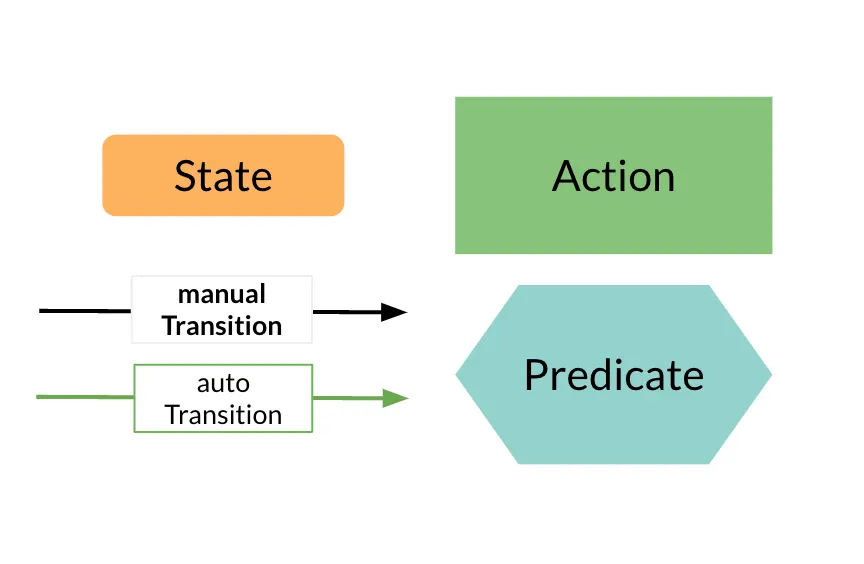

Graphical entity workflow elements: State, Transition, Action, Predicate

### **The example of the Careful Turnstile**

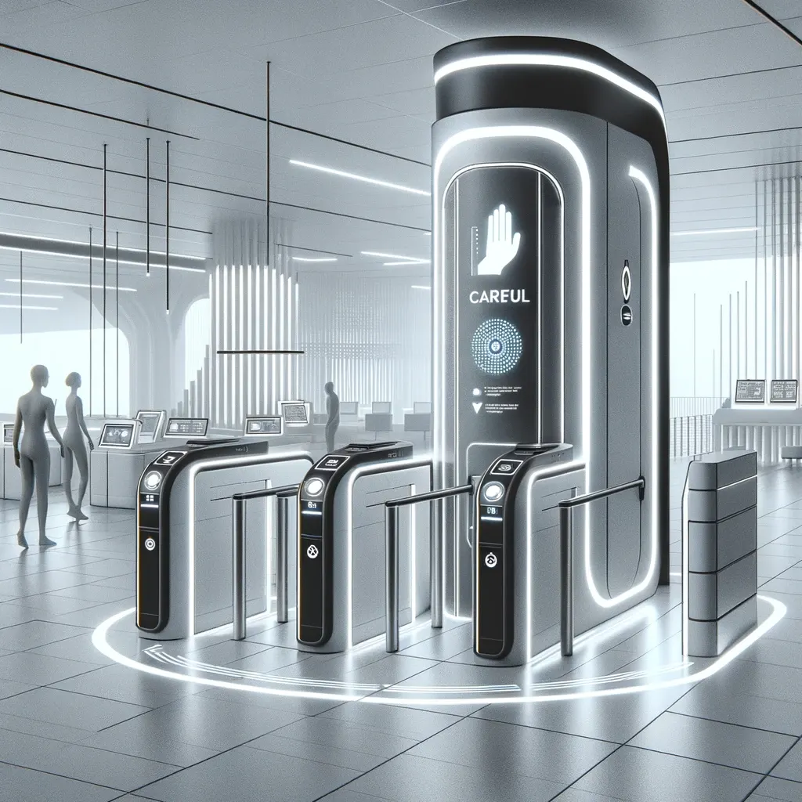

Let’s look at the classical example of the turnstile as a finite-state machine.

In words, we can formulate the requirement as

*A turnstile entity has two states: LOCKED and UNLOCKED. When a turnstile entity is created it shall automatically go to the LOCKED State via transition “New”. From the outside, the entity can be saved with the Transition “Coin” or “Push”. Coin Transitions bring it to an UNLOCKED state. Push Transitions to LOCKED state.*

Visually it’s much easier to grasp:

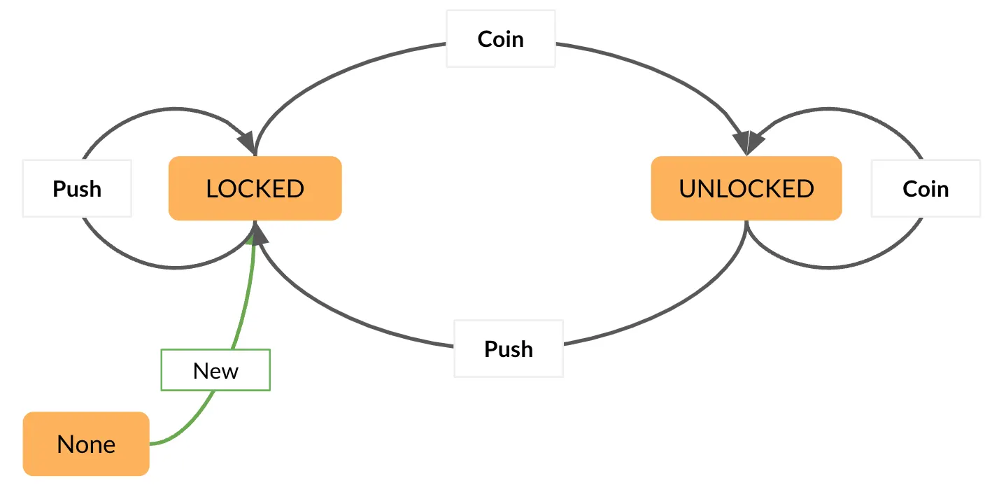

The Simple Turnstile

This entity workflow reflects the state of a turnstile, but with this workflow, all relevant interactions are done elsewhere; it only mirrors the physical state of the device and the rules governing *Transitions*. This isn’t very interesting, so let’s make it do something.

*All Transitions into the LOCKED State shall send a signal to the device to lock it. All Transitions into the UNLOCKED State shall send a signal to unlock it.*

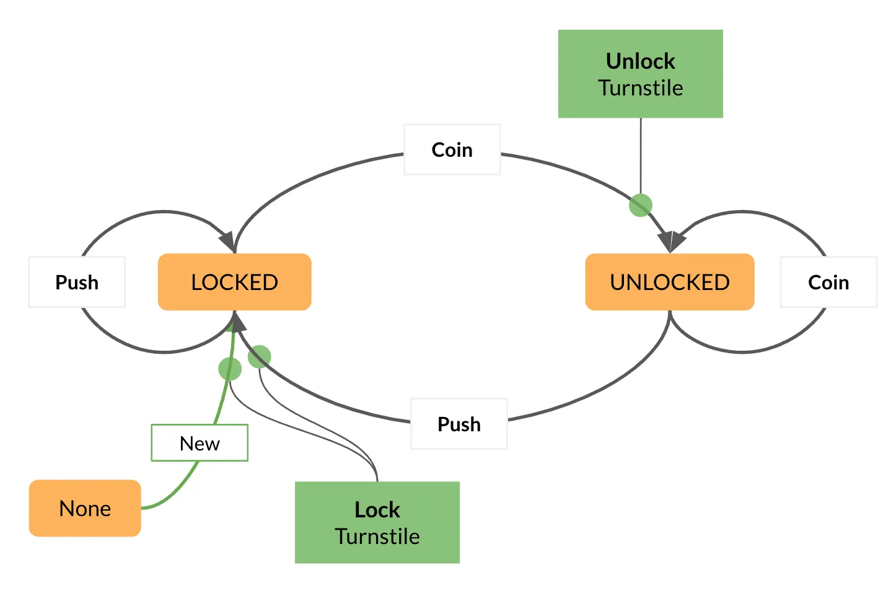

Add lock/unlock Actions

We have added two *Actions* to the entity workflow: *Lock Turnstile* and *Unlock Turnstile*. Somebody will have to implement this, but we’ll get to how that is done later.

Let’s try to make it more interesting. Suppose the device has sensors that detect if it is safe to pass. Let’s specify the expectations directly in workflow:

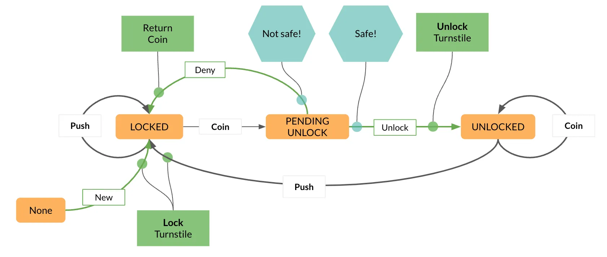

Check before unlocking. Is it safe to let someone in?

We have now started using ***Automated Transitions***. When someone tries to add a coin when the device is LOCKED, it will transition to UNLOCKED only if it is safe, otherwise, it will return the coin and stay LOCKED. We implement this by introducing the PENDING UNLOCK as an intermediate state from which it can exit via two *Automated Transitions*. Unless there is a bug, it will never actually stop in PENDING UNLOCK.

Moving on, suppose we have a turnstile that has status lights we can control, and we have a means to know if the device is online or not.

Press enter or click to view image in full size

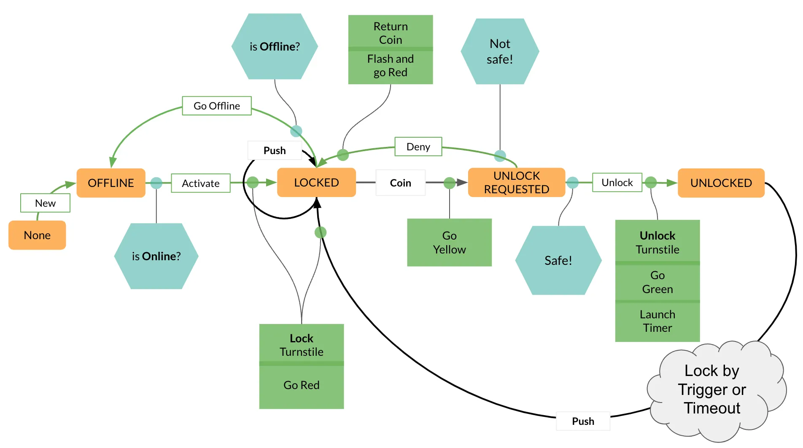

A very careful turnstile

We have added an OFFLINE *State*, some more *Predicates,* and *Actions* to update the status lights.

Let’s reflect on what we have done here…

**Using imagery** to convey information aligns deeply with how people think. It taps into our innate cognitive abilities to understand complex data more naturally and quickly. It’s a powerful way to communicate and enhance understanding across various contexts.

**Using workflow-based design** dissects things systematically into well-defined pieces that can be clearly specified and implemented.

**Most things are iterative**. You might notice that we’ve gone from a simple state machine and continually added features to it. It wasn’t just to walk you through the Careful Turnstile, but to illustrate that most thought processes are iterative. And between such iterations, in the digital world there is often a (software) release cycle involved. We’ve dissected the development tasks into well-defined units, an *Action* here, and a *Predicate* there.

*Actions* and *Predicates* are reusable components. Specifying expected behavior via **entity workflow** **helps us to accommodate change more easily** and avoid sunk costs.

But there is something even better\! Read on…

## **The EDBMS leads to Event-Driven Architecture**

An event-driven architecture (EDA) is a compelling approach since it empowers systems to be highly responsive and adaptive by basing interactions on the occurrence of events. This model facilitates real-time processing and greater scalability by decoupling services and allowing them to communicate through asynchronous events. The architecture reduces bottlenecks, improves performance, and enhances system flexibility and resilience, enabling businesses to easily integrate new functionalities and respond swiftly to changing operational or market conditions, making it a powerful approach in dynamic business environments.

An EDBMS is an engine that (amongst other things) manages entities within their respective workflows. If it functions in the manner described above, I hope it’s obvious that

***The EDBMS is a foundation for Event-Driven Architecture***

Why? Because,

*A **Workflow Action** is like an **event trigger.** An Action can create or update other entities, send notifications to subscribers, etc.*

***Manual Transitions** are like **event handlers**. They have to be triggered explicitly, i.e. by an event from somewhere else.*

In the turnstile example, the *Actions* triggered events to lock or unlock the turnstile, return a coin, and so on. The event that a coin was inserted, or the turnstile pushed was dealt with by executing a *Transition*.

That’s not quite enough, though. You need to mix in automation on transitions:

***Automated Transitions*** tell the EDBMS to push onward based on rules (*Predicates*). The execution of these automated transitions leads to a flow, a logic that is governed by the workflow structure and its elements.

In the turnstile example, inserting a coin sends it to an intermediate state, from there a decision is made to either unlock the turnstile or return the coin and remain unlocked. With *Automated Transitions*, you can structure very intricate flows.

### **Event-based interactions between entities**

I would like to take an example in finance around the topic of regulatory transaction reporting and illustrate how a set of entities interact via workflow Actions. A single external event leads to a cascade of subsequent events governed by the workflows of the respective entities.

We introduce four entities:

* **IncomingMessage**: An entity that holds an XML payload and metadata delivered by an external source.  
* **Trade**: An entity that represents an OTC derivative trade containing all attributes for valuations, position keeping, and contractual data.  
* **OutgoingMessage**: An entity that holds an XML payload and metadata to be delivered to an external source.  
* **SeedMessage**: An entity that produces and saves a specified number of incoming InterfaceMessages for testing purposes.

Let’s look at the SeedMessage first:

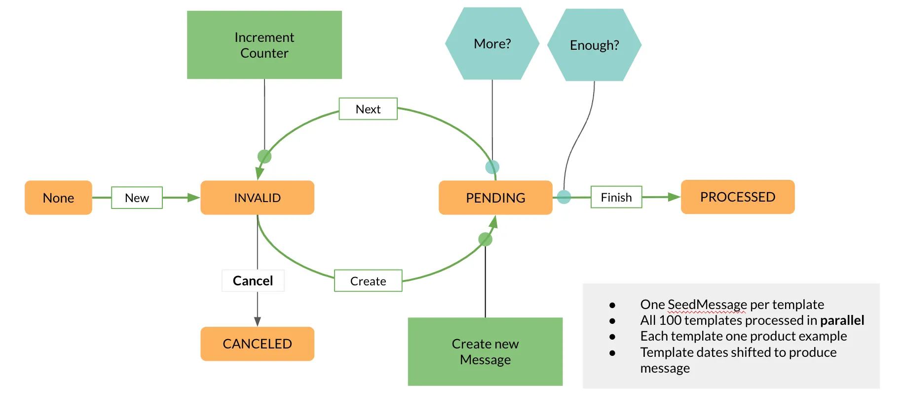

A test data generator via entity workflow

This is a simple, but interesting example. The *Action* to *Create new Message* is fire-and-forget. This *Action* is launched asynchronously into an event queue in the EDBMS to create a new entity in the system.

In the workflow, it loops a set number of times until the required number of InterfaceMessages have been published. It’s a very simple way to create a maximal data load to test processing performance.

Next, we define the entity workflow for IncomingMessages

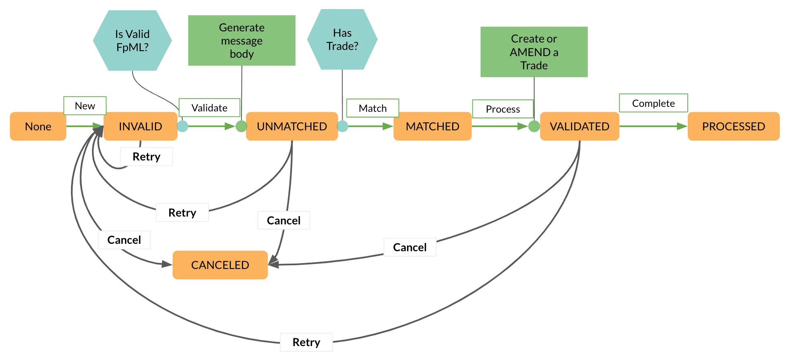

An incoming FpML message that creates or updates Trades

This entity validates the XML payload, parses it into a structured Java object, checks if there is a corresponding Trade object in the right *State*, and then goes on to update the Trade or create a new one.

The Trade entities themselves have the following lifecycle:

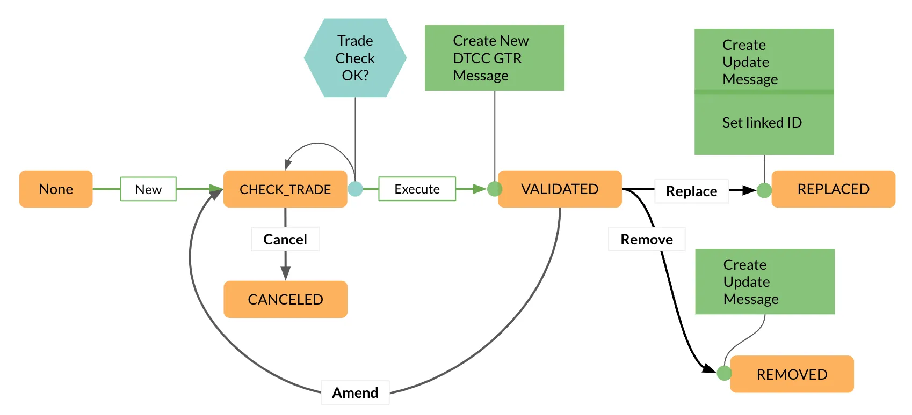

A simple trade workflow in a reporting system

Validated Trades are used for reporting, and checks are done on creation or updates. Also, all validated Trade updates create an OutgoingMessage for reporting to a regulatory body, similarly for replacements and removals.

Finally, the OutgoingMessage workflow encapsulates the logistics needed for formatting and sending messages out the door, and subsequent handling of acknowledgments from the receiver:

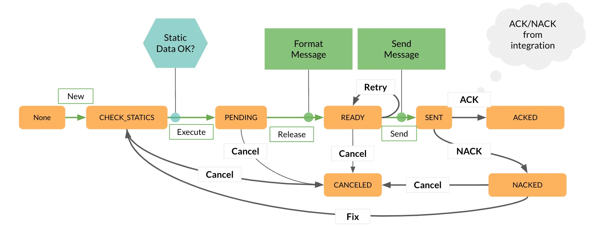

A logistical workflow for outgoing messages

With this setup,

* a SeedMessage produces a flood of IncomingMessages.  
* Each IncomingMessage produces or updates a Trade.  
* The Trade emits OutgoingMessages within its lifecycle.

In short, this is an EDA.

## **The EDBMS as an application platform**

Now we come to the crunch of all this. You might have been asking yourself how to implement the logic inside these *Actions* and *Predicates*. After all the EDBMS is a service, and it needs some way to execute them. Is the code somehow injected? The answer is no, nothing is injected. Instead:

The EDBMS ***externalizes*** the execution of *Actions* and *Predicates* to a cluster of connected clients.

This is sort of what it looks like with Cyoda:

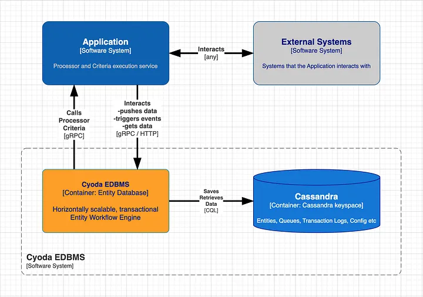

## **An application interacting with the Cyoda EDBMS**

To the EDBMS, the above “Application” is just a cluster of compute nodes that execute *Actions* and *Predicates*. But in fact, these form part — if not all — of the nodes that compose an entire digital service or application.

Note that we have three independent clusters each representing horizontally scalable services:

* Cassandra as the storage service  
* Cyoda as the transactional entity workflow engine  
* The client service to execute *Actions* and *Predicates*

The EDBMS is *available* if all three services are available. Each can be scaled independently. It is *highly available* due to its distributed architecture.

With an appropriate operational underpinning to give the client the ability to deploy their workers onto a containerized infrastructure, we’ve got a scalable application platform\!

## **Conclusion**

An EDBMS that integrates the capability to run custom ***Actions*** and implement ***Automated Transitions***, guarded by ***Predicates*** governing the flow, effectively lays the basis for an event-driven architecture (EDA). By delegating the execution of *Actions* and *Predicates* to an application, it shifts the traditional boundaries between databases and application logic.

The EDBMS architecture substantially minimizes the complexity involved in building scalable, transactional, and robust event-based systems. By shifting much of the system’s operational and architectural demands onto the EDBMS, the amount of code and the number of moving parts that developers need to manage are drastically reduced. This simplification allows developers to focus on functionality rather than infrastructure.

Moreover, with the right operational infrastructure in place to support the deployment of these nodes onto a containerized platform, the EDBMS evolves from being just a database management system to a full-fledged application platform. This platform not only supports but enhances the development and scaling of applications, providing a robust foundation for handling complex, event-driven entity workflows with high efficiency and reliability.

*I would like to thank Szymon Szukalski for his valuable and insightful input. Thanks also to my colleagues at Cyoda Ltd. for their patient listening and constructive feedback. This work was made possible by my family’s willingness to let me work at night.* 😃
