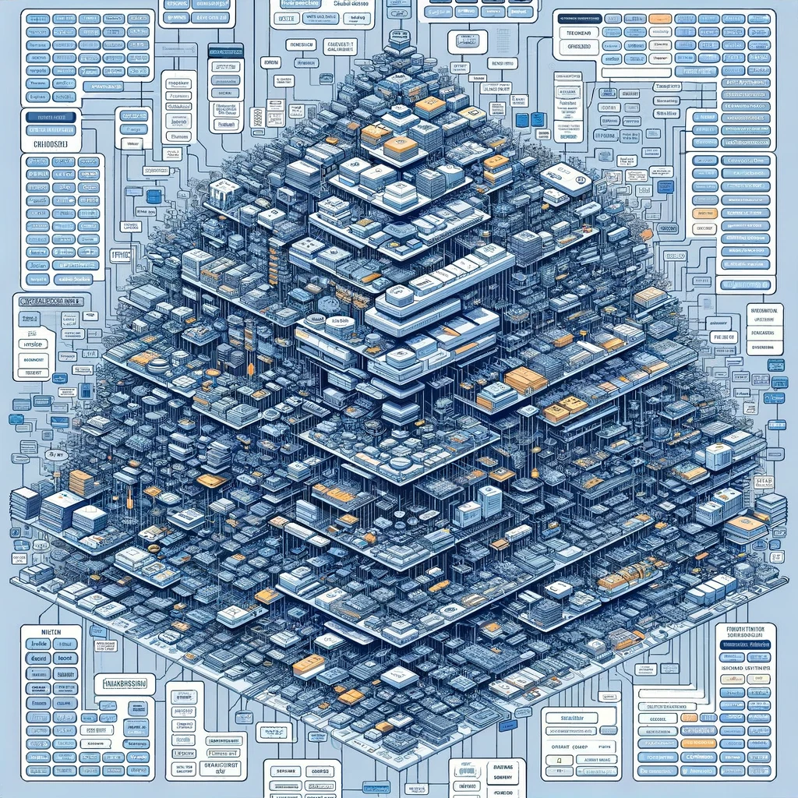
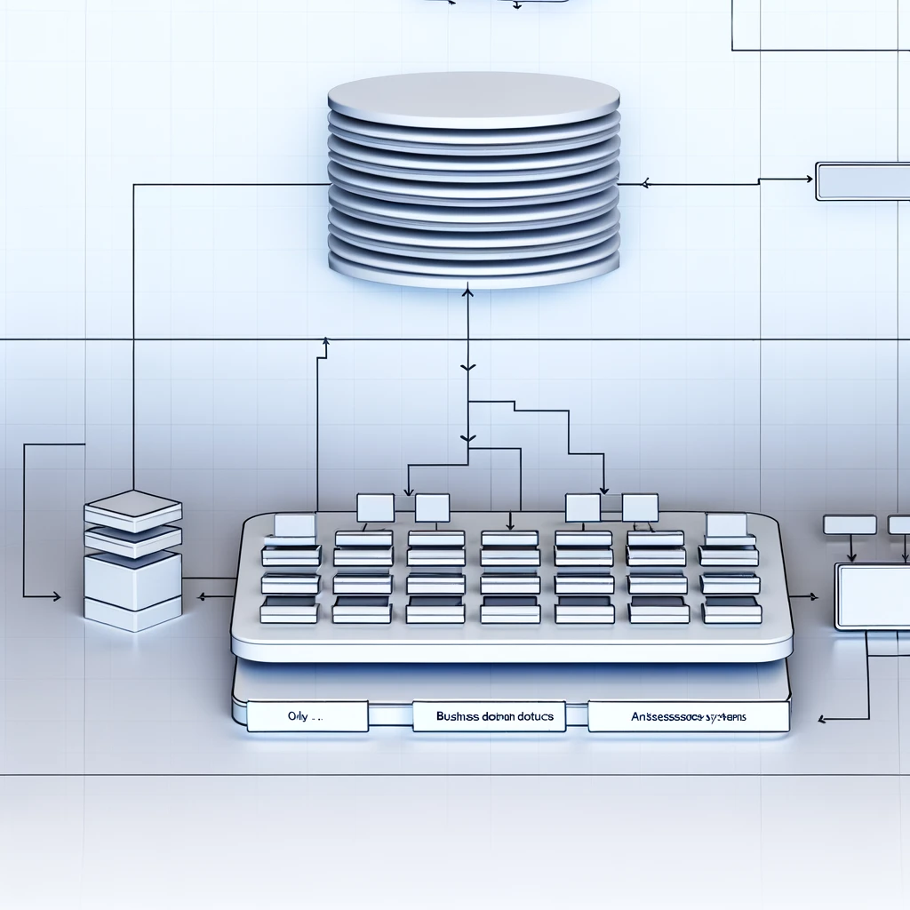
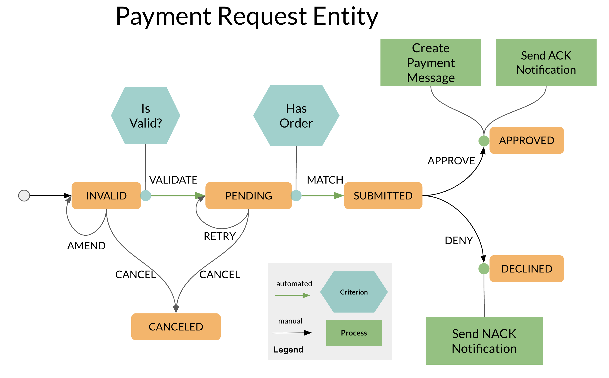
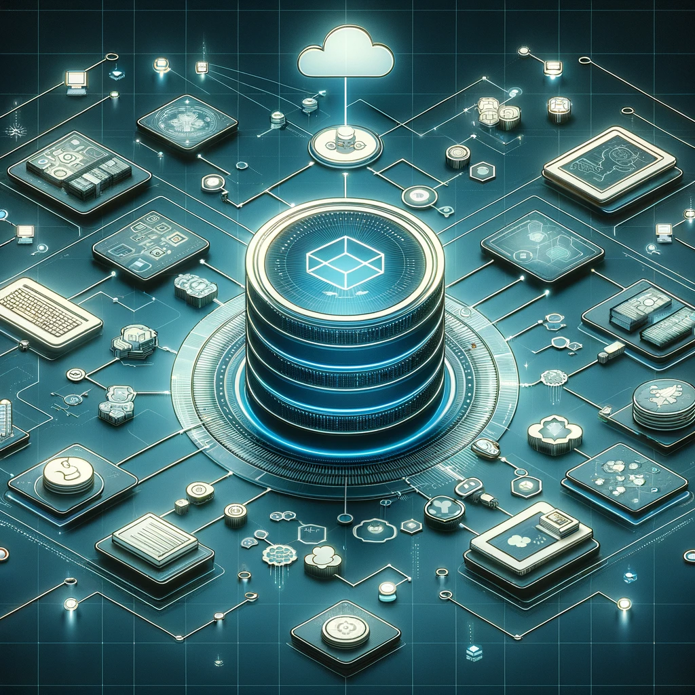

# **What’s an Entity Database?**

Making a case for a better DBMS in environments where data and processes are tightly interlinked.

This article first appeared on [LinkedIn](https://www.linkedin.com/pulse/whats-entity-database-paul-schleger-edzec).

There are so many database types and database management systems out there. Why do we need more of them?

What I’m going to tell you here isn’t revolutionary, and in hindsight possibly obvious. But when I look at database systems out there, none of them really combine certain things that I’d like to have, which would make it easier to build systems with. I mean data intensive systems. Systems that do the heavy lifting in organizations.

## **Simplify my work-life, please\!**

By far, most DBMS are just that: they store data and let you retrieve it. If I want to ***do*** something with the data, I need to mix in a whole slew of things, subsystems, pipelines, frameworks, software and so on. Only then do I actually ***process*** data.

Basically, all systems are a composition of many diverse things. The less moving parts I have, the easier it becomes to build useful stuff … as long as the parts fit together.

But actually, although the rapidly increasing computing and software capabilities lets us do so much more, the associated system architectures are becoming more and more complex, and getting them to work together properly is a big challenge.

And, no, I don’t think the advent of micro-services has made this any easier.

I call this building **fat systems**, analogous to fat clients in software architecture. But I’d like to build **thin systems**.

  

    
    
<em>Fat System</em>

  

  

    
    
<em>Thin System</em>

  

What would you prefer to build and operate, a fat system (left) or a thin system (right)?

My passion is being creative and seeing results, making things that really function. The satisfaction comes from finishing the job and seeing it work. I like anything that gets me there faster.

So, how can we simplify things and build “thinner” systems? Let’s take a step back. At a sufficiently abstract level, systems actually only do three things:

1. ingest information  
2. change, delete or create new information  
3. make information accessible

The process to produce valuable information can be very complex. It’s not the same as data, by the way. Information is knowledge.

Just about every system needs a database. It’s at the heart of your information processing. Let’s see if we can specify a type of DBMS that does more than just storage and retrieval, a DBMS that incorporates the fundamentals of data processing into a coherent structure that can help me **build thinner systems**

This isn’t so crazy, actually. Triggers and stored procedures in relational DBs was an early attempt at **pushing processing and logic into the database**.

## **Think in Entities**

Databases are low level beasts that look at data in a very technical way. But people don’t think in tables, key-value pairs, or even nodes and edges for that matter.

Document databases is a step in the right direction. But I prefer to think in entities, because it encapsulates a very important critical factor: states and rules.

**What’s an entity?**

If we google that we find a nice definition

*An entity is a thing with a distinct and independent existence.*

In computing, an entity is a self-contained unit that exists independently within a system. It has a **well-defined lifecycle**, including a beginning, potential transformations, and an end. This lifecycle aspect is crucial as it allows the entity to undergo various state changes and processes, making it dynamic rather than static data. So an entity is more just an identifiable unit of data, it is inherently coupled to its lifecycle.

*Without the coupling to the lifecycle, you don’t have an entity, just data.*

Entities are a very convenient way to look at information: An entity represents a real-world object, something we can imagine, something we can relate to. The notion that things have a lifecycle is intuitive to us. The notion that we have rules that govern the transitions of things from one state to another is equally intuitive.

Since in computing all things are discrete, it makes sense to define an entity having a discrete number of possible states; a finite **state machine**. With this view, an instance of an entity is basically a state machine.

<figure style="text-align: center; margin: 20px 0;">
  
  <figcaption style="font-style: italic; margin-top: 10px; color: #666;">
    Example entity workflow: A payment request
  </figcaption>
</figure>

**The advantages of Entity State Machines**

Viewing information as entity state machines offers significant advantages:

It is a **visual and intuitive representation** of the domain, providing a clear and structured visual representation of business processes, making it easier for business people to understand and communicate requirements. I’ve worked with BAs for years, and using workflow is a great way to collaborate on requirements.

Using entity state machines allows for the modeling of complex business workflows directly within the database, and leads to a better **alignment with the business logic**. Since business people often think in terms of processes and outcomes — such as approval workflows, order processing, or customer relationship management — the state machine model resonates well because it mirrors these real-world processes.

Entity state machines provide the **flexibility to adapt to changes** in business processes without extensive reconfiguration of the underlying database structure.

By defining clear rules for how entities can behave and transition between states, businesses gain **enhanced control** over their operations. This control ensures **predictability** in how the system handles data, providing businesses with confidence that their IT systems are robust, compliant, and directly aligned with their operational goals.

The concept of entity state machines not only makes the system **more intuitive and aligned with business thinking** but also enhances its capability to **manage complex data and processes effectively**. This approach results in IT systems that are not just functional but also strategic assets tailored to the specific needs and dynamics of the business.

Let’s build on that\!

## **The Entity Database**

An entity database is a system designed to store, manage, and manipulate entities — distinct, identifiable units of data that have an independent existence. These entities can represent anything from real-world things and people, to concepts and events.

Just about any DBMS can handle that.

## **The Entity DBMS (EDBMS)**

What sets an ***EDBMS*** apart is its capability to handle bespoke processes and trigger events during state transitions, all while maintaining transactional integrity.

This approach provides a unique angle that is not fully realized in current systems.

It allows you to build **thin systems** based on a state-driven process-oriented design. A whole chunk of the architectural complexity is abstracted away from the implementation. Much of the mechanics and non-functional aspects of an application is taken off the hands of the build team. An EDBMS offers a cohesive backbone that explicitly incorporates data processing features that significantly reduce the number of moving parts that have to fit together and allow you to focus on the core of the business functionality. An EDBMS simplifies the IT architecture, meaning **your system is thinner**.

This makes an EDBMS incredibly valuable in environments where data and processes are tightly interlinked. I think that fields like regulatory compliance, healthcare management, complex manufacturing, and sophisticated CRM systems can particularly benefit from this technology.

*An EDBMS is not just a repository of data; it acts as an active participant in the operational logic of an organization.*

## **EDBMS serving entire digital ecosystems**

An EDBMS simplifies, accelerates and lowers the cost of building and maintaining applications and (micro)services. A scalable **EDBMS as a Service** allows you to consolidate and homogenize the IT architecture, with all the associated benefits.

  

    
  

  

    EDMBS as the foundation of a digital ecosystem
  

Simplify, Accelerate, Lower Costs

**Simplification**  
An EDBMS as a Service inherently simplifies the architecture of applications and micro-services by handling complex entity relationships, state management, and lifecycle transitions within the service layer itself. This means developers can focus more on the business logic and less on the intricacies of data management and state consistency across services.

**Acceleration**  
The simplification provided by an EDBMS, directly contributes to faster development and deployment cycles. By abstracting the complex aspects of data handling, developers can bring new features and services to market more quickly, enhancing responsiveness to business needs and competitive pressures.

**Cost Reduction**  
Maintaining a traditional database architecture involves significant overhead, especially when scaling and managing multiple service-specific databases. A scalable EDBMS reduces these costs by centralizing data management in a single, more efficient system that scales on demand. This reduces both operational expenses (like hardware and maintenance) and capital expenses (like investments in infrastructure).

**Consolidation and Homogenization**  
By using a scalable EDBMS, organizations can consolidate multiple disparate databases and data management solutions into a single, unified platform. This homogenization not only simplifies the IT landscape but also reduces fragmentation, leading to better data consistency and easier compliance with regulations. Additionally, it simplifies training and support, as the IT team needs to be proficient in only one system rather than multiple specialized tools.

**Additional Benefits**

1. **Enhanced Performance**: Scalability ensures that the system can handle growing data volumes and user loads without degrading performance, crucial for applications requiring high availability and real-time data processing.  
2. **Improved Security**: A unified system reduces the complexity of securing data across multiple databases and interfaces. A central EDBMS can enforce uniform security policies and ensure comprehensive data protection.  
3. **Flexibility for Future Growth**: As business needs evolve, a scalable EDBMS can adapt more easily to changing requirements, whether this involves integrating new technologies, expanding into new markets, or accommodating increased data loads without requiring a fundamental redesign of the IT infrastructure.

By integrating these core benefits, a scalable EDBMS offers a powerful platform for building and maintaining applications and services, aligning IT capabilities directly with business strategies and operational demands. This strategic alignment not only drives immediate operational benefits but also positions the organization for sustainable growth and innovation.

## **Conclusion**

To answer the question at the beginning: Yes, I think there is room and the need for yet-another-DBMS.

An Entity Database Management System (EDBMS) improves how services, applications, and entire systems can be constructed by simplifying and streamlining architectural complexity. It intuitively aligns with how people conceptualize business processes, encapsulating a broad spectrum of functional and non-functional requirements within a coherent structure. This not only accelerates development but also enhances the alignment of IT systems with business logic.

Further amplifying these benefits, an EDBMS offered as a Service dramatically reduces operational complexity. This service model offloads much of the day-to-day management burden, allowing organizations to focus more on strategic activities rather than infrastructure maintenance.

Distinct from traditional DBMS architectures, an EDBMS could represent the genesis of a new class of database management systems. By redefining the core functionalities of data handling and processing, this innovative approach is particularly suited to industries and applications where the intricate life-cycles of data entities and their complex interactions are paramount.

The overall goal is to reduce the complexities in current data management technologies, providing more efficient solutions for sophisticated data processing challenges. This can pave the way for cutting-edge solutions and methodologies in data management, reshaping how data-centric environments operate and thrive.
