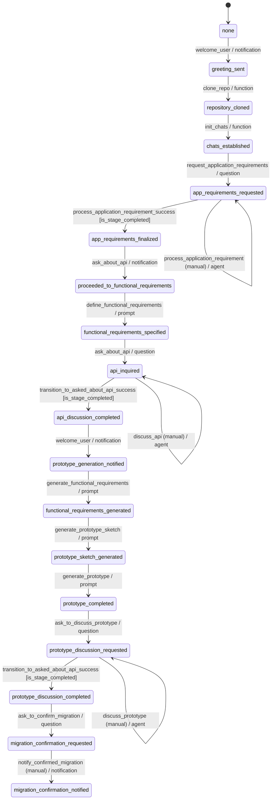

= A Deep Dive into a Finite State Machine for Application Prototype Building
:toc:
:toclevels: 2
:date: 2025-03-24

video::assets/building_hello_world_app.mp4.mp4[]

Now let's take a look at a different flow that outlines the structured process for gathering requirements, discussing APIs, generating prototypes, and confirming migration in an application development cycle.

1. **Initial State**: The process begins in the `none` state.
2. **Greeting Sent**: A welcome message is sent to the user (`welcome_user`), initiating the flow.
3. **Repository Cloning**: The system clones the required repository (`clone_repo`).
4. **Chats Established**: Communication channels are initialized (`init_chats`).
5. **Application Requirements Gathering**:
   - The system requests application requirements from the user (`request_application_requirements`).
   - The process remains in this state until the application requirements are manually reviewed (`process_application_requirement`).
   - Once the requirements are successfully processed (`process_application_requirement_success`), the flow moves forward.
6. **Functional Requirements Specification**:
   - The system asks about API needs (`ask_about_api`).
   - The user defines the functional requirements (`define_functional_requirements`).
   - API discussions occur (`discuss_api`), which require manual intervention.
   - Once the API discussions are completed successfully (`transition_to_asked_about_api_success`), the process advances.
7. **Prototype Generation**:
   - Functional requirements are transformed into a functional design (`generate_functional_requirements`).
   - A prototype sketch is created (`generate_prototype_sketch`).
   - The full prototype is generated (`generate_prototype`).
8. **Prototype Discussion**:
   - The system asks if the user wants to discuss the prototype (`ask_to_discuss_prototype`).
   - The prototype is discussed manually (`discuss_prototype`).
   - Once the discussion is successfully completed (`transition_to_asked_about_api_success`), the flow proceeds.
9. **Migration Confirmation**:
   - The system asks the user to confirm migration (`ask_to_confirm_migration`).
   - Upon confirmation, a notification is sent (`notify_confirmed_migration`), completing the process.

This structured approach ensures a systematic transition from requirement gathering to prototype creation and migration, with manual intervention points where necessary.





## Workflow Transitions: Types and Patterns

This FSM is composed of various transitions that govern the application prototyping process. Each transition is carefully defined to facilitate dynamic behavior and seamless interactions.

=## Agent-Based Transitions

Transitions with `"type": "agent"` are designed to:
- Engage an autonomous decision-making process by leveraging natural language understanding.
- Integrate external tools (such as `web_search`, `read_link`, and `web_scrape`) to gather additional context or external data.
- Process user requirements dynamically and ask follow-up questions as needed.

For example, in the `"process_application_requirement"` transition, the agent collects detailed user inputs, refines the requirements, and integrates external information—all before advancing to the next stage.

=## Manual Transitions (Human in the Loop)

Manual transitions, flagged with `"manual": true`, enforce human oversight in critical steps. Their purposes include:
- Allowing a human operator or user to review and validate decisions before the FSM proceeds.
- Enabling iterative refinement and quality control, particularly in complex scenarios such as API discussions or prototype reviews.
- Ensuring that any automated action is aligned with nuanced user expectations, thus minimizing the risk of error.

The `"discuss_api"` transition is a prime example, where human intervention is required to review and guide the next steps.

=## Function Definitions

Functions in the FSM are defined with clear and strict configurations:
- **Name and Description:*- Each function, such as `clone_repo` or `init_chats`, has a descriptive name and a clear explanation of its purpose.
- **Configuration Parameters:*- The functions include properties like `"publish"` and `"allow_anonymous_users"`, ensuring consistency in their execution.
- **Structured Input Requirements:*- Some functions enforce strict parameter definitions (e.g., requiring both a URL and a CSS selector for web scraping), which enhances reliability and reduces errors during execution.

These definitions help in modularizing tasks and ensuring that each function performs its role effectively within the FSM.

=## Main Patterns in the Workflow

==## Loops and Iterative Refinement

The FSM employs loops to allow for repeated transitions until certain conditions are met. For example:
- The application requirement process loops until all necessary information is refined.
- Condition checks, such as those using `is_stage_completed`, determine when it is appropriate to exit a loop.

This pattern supports continuous improvement and avoids premature advancement to subsequent stages.

==## Human in the Loop

By incorporating manual transitions:
- The workflow ensures human intervention where automated decisions might fall short.
- Feedback cycles are built into the process, enabling users to provide corrections and suggestions before finalizing any stage.
- This balance between automation and human input increases both the accuracy and reliability of the system.

==## Prompt Engineering and Chaining

The FSM leverages prompt engineering to guide its automated responses:
- Detailed prompts instruct the model to generate outputs in a specific format, such as markdown documents with diagrams.
- Chaining of prompts allows one output to serve as the basis for the next stage, ensuring coherent and continuous development of the application prototype.

==## Tool Integration

The system integrates a variety of external tools within agent transitions:
- Tools like `web_search`, `read_link`, and `web_scrape` expand the system’s capabilities by fetching and processing external data.
- The flexible orchestration of these tools means that the FSM can adjust its behavior based on the context provided by the user or external sources.

## Memory Management

Effective memory management is crucial for maintaining continuity and context in the FSM. Here’s how memory is managed:

- **Persistent Entity Storage:*-  
  The FSM is attached to an entity that serves as a persistent memory store. This entity logs every state transition, including user inputs, decisions, and outputs. By doing so, it ensures that the complete history of interactions is available at any point.

- **State Transition Logging and Context Preservation:*-  
  Each transition—whether from `"none"` to `"greeting_sent"` or later stages—is logged in this memory store. This enables:
  - Seamless transitions between states.
  - Iterative refinement, where previous inputs and decisions are retained and built upon.
  - Rollback capabilities, allowing the system to revert to an earlier state if necessary.

- **Supporting Iterative and Looping Processes:*-  
  The FSM uses its memory to keep track of iterative loops. When a state loops (e.g., during application requirement processing), all partial inputs and previous iterations are maintained. This ensures that new inputs can be integrated smoothly with the historical context.

- **Integration with External Tools and Human Interventions:*-  
  Memory not only records automated actions but also preserves human feedback during manual transitions. This contextual history is then utilized in subsequent agent actions and prompt chains, ensuring that every decision is informed by the full interaction history.

- **File-Based Artifacts:*-  
  Output files such as `entity/functional_requirement.md` and `entity/prototype.py` are also part of the memory management strategy. These files act as tangible records of the evolving application specifications and codebase.

[source,json]
----
{
  "initial_state": "none",
  "states": {
    "none": {
      "transitions": {
        "welcome_user": {
          "next": "greeting_sent",
          "action": {
            "name": "process_event",
            "config": {
              "type": "notification",
              "notification": "\uD83D\uDC4B Welcome to Cyoda Application Builder! We’re excited to build something amazing with you! \uD83D\uDE04  \n\nWe’re here to help with building and deploying on Cyoda Cloud! Reach out anytime! \uD83C\uDF1F Your branch will be ready soon, and I’ll notify you when I push changes. If you have suggestions, message me or use Canvas! \uD83D\uDE0A  \n\nIn Canvas, you can code, edit, and improve around the main app build flow! It’s a great way to collaborate and make changes! \uD83D\uDCBB  \n\nIf you’re happy with the progress or want me to pull your changes, just give me a thumbs up! \uD83D\uDC4D  (currently approve button in the top panel)\n\nIf something goes wrong, no worries—just roll back! \uD83D\uDE2C Your app will be live on Cyoda Platform GitHub soon! \uD83D\uDE80 Let’s build your branch together! \uD83C\uDF3F",
              "publish": true,
              "allow_anonymous_users": true
            }
          }
        }
      }
    },
    "greeting_sent": {
      "transitions": {
        "clone_repo": {
          "next": "repository_cloned",
          "action": {
            "name": "process_event",
            "config": {
              "type": "function",
              "function": {
                "name": "clone_repo",
                "description": "Clones template repository"
              },
              "publish": true,
              "allow_anonymous_users": true
            }
          }
        }
      }
    },
    "repository_cloned": {
      "transitions": {
        "init_chats": {
          "next": "chats_established",
          "action": {
            "name": "process_event",
            "config": {
              "type": "function",
              "function": {
                "name": "init_chats",
                "description": "Initialises ai service"
              },
              "allow_anonymous_users": true
            }
          }
        }
      }
    },
    "chats_established": {
      "transitions": {
        "request_application_requirements": {
          "next": "app_requirements_requested",
          "action": {
            "name": "process_event",
            "config": {
              "type": "question",
              "question": "💡 What kind of application would you like to build? I'd love to hear your ideas! Feel free to share them with me! 😊",
              "example_answers": [
                "Hello, I would like to download the following data: [London Houses Data](https://raw.githubusercontent.com/Cyoda-platform/cyoda-ai/refs/heads/ai-2.x/data/test-inputs/v1/connections/london_houses.csv), analyze it using **pandas**, and save a report. 📊"
              ],
              "publish": true,
              "allow_anonymous_users": true
            }
          }
        }
      }
    },
    "app_requirements_requested": {
      "transitions": {
        "process_application_requirement": {
          "next": "app_requirements_requested",
          "manual": true,
          "action": {
            "name": "process_event",
            "config": {
              "type": "agent",
              "publish": true,
              "allow_anonymous_users": true,
              "model": {},
              "tools": [
                {
                  "type": "function",
                  "function": {
                    "name": "web_search",
                    "description": "Search the web using Google Custom Search API. Use this function when you need to formulate questions or requirements for information to be searched online. For example, if the user wants to add data sources for an API but does not provide an exact link or documentation.",
                    "strict": true,
                    "parameters": {
                      "type": "object",
                      "properties": {
                        "query": {
                          "type": "string"
                        }
                      },
                      "required": [
                        "query"
                      ],
                      "additionalProperties": false
                    }
                  }
                },
                {
                  "type": "function",
                  "function": {
                    "name": "read_link",
                    "description": "Read content from a URL. Use this function when you need to fetch content from a web resource. For example, if the user wants to add data sources for an API and provides an exact link, you should first read the link contents before proceeding with analysis.",
                    "strict": true,
                    "parameters": {
                      "type": "object",
                      "properties": {
                        "url": {
                          "type": "string"
                        }
                      },
                      "required": [
                        "url"
                      ],
                      "additionalProperties": false
                    }
                  }
                },
                {
                  "type": "function",
                  "function": {
                    "name": "web_scrape",
                    "description": "Scrape content from a webpage using a CSS selector. Use this function when you need to scrape online content. For example, if the user wants to add data sources for an API and provides an exact link for web scraping, you should scrape the resource before analyzing the question.",
                    "strict": true,
                    "parameters": {
                      "type": "object",
                      "properties": {
                        "url": {
                          "type": "string"
                        },
                        "selector": {
                          "type": "string"
                        }
                      },
                      "required": [
                        "url",
                        "selector"
                      ],
                      "additionalProperties": false
                    }
                  }
                },
                {
                  "type": "function",
                  "function": {
                    "name": "set_additional_question_flag",
                    "description": "Set true if user question requires clarification or discussion, set false if you have enough information or the user asks to proceed to the next question",
                    "strict": true,
                    "parameters": {
                      "type": "object",
                      "properties": {
                        "transition": {
                          "type": "string",
                          "enum": [
                            "process_application_requirement"
                          ]
                        },
                        "require_additional_question_flag": {
                          "type": "boolean"
                        }
                      },
                      "required": [
                        "require_additional_question_flag",
                        "transition"
                      ],
                      "additionalProperties": false
                    }
                  }
                }
              ],
              "messages": [
                {
                  "role": "user",
                  "content": [
                    " Hello! You are a python quart developer.",
                    " You're building a backend application.",
                    " Currently you are focusing on functional requirements, and will cover any non-functional requirement later.",
                    " Let's analyse this request for application building, and clarify any important functional requirements that necessary.",
                    " Ask questions if something is not clear enough and make suggestions that will help us formulate formal specification in the next iterations.",
                    " Make sure your answers are friendly but up-to-the point and do not start with any exclamations, but rather answer the question. Max tokens = 300.",
                    " If there are any links or action requests in my requirement, please first follow these links or do any requested action in order to get the full understanding, and only then proceed to answering the question.",
                    " Here is my requirement: "
                  ]
                }
              ],
              "tool_choice": "auto",
              "max_iteration": 30,
              "approve": true
            }
          }
        },
        "process_application_requirement_success": {
          "next": "app_requirements_finalized",
          "condition": {
            "config": {
              "type": "function",
              "function": {
                "name": "is_stage_completed",
                "description": "Clones template repository",
                "params": {
                  "transition": "process_application_requirement"
                }
              }
            }
          }
        }
      }
    },
    "app_requirements_finalized": {
      "transitions": {
        "ask_about_api": {
          "next": "proceeded_to_functional_requirements",
          "action": {
            "name": "process_event",
            "config": {
              "type": "notification",
              "notification": "Let's proceed to functional requirements. Please, give me a moment to think everything over.",
              "publish": true,
              "allow_anonymous_users": true
            }
          }
        }
      }
    },
    "proceeded_to_functional_requirements": {
      "transitions": {
        "define_functional_requirements": {
          "next": "functional_requirements_specified",
          "action": {
            "name": "process_event",
            "config": {
              "type": "prompt",
              "publish": true,
              "allow_anonymous_users": true,
              "model": {},
              "messages": [
                {
                  "role": "user",
                  "content": [
                    " Please, help me define the functional requirements for my project.",
                    "Outline the necessary API endpoints (adhering to Restful rules, any business logic that invokes external data source, retrieves data or does any calculations needs to be done in POST endpoint, GET is used only for my application results retrieval (external data retrieval should be implemented in POST endpoint)),",
                    "including details on request/response formats. Additionally, provide a visual representation of the user-app interaction using Mermaid diagrams (e.g. journey/sequence).",
                    "Please return markdown document without any additional information.",
                    "Each diagram should be wrapped into ```mermaid ...```"
                  ]
                }
              ]
            }
          }
        }
      }
    },
    "functional_requirements_specified": {
      "transitions": {
        "ask_about_api": {
          "next": "api_inquired",
          "action": {
            "name": "process_event",
            "config": {
              "type": "question",
              "question": "Let's discuss the API for your application together. Would you like to enhance the current version?",
              "publish": true,
              "approve": true,
              "allow_anonymous_users": true
            }
          }
        }
      }
    },
    "api_inquired": {
      "transitions": {
        "discuss_api": {
          "next": "api_inquired",
          "manual": true,
          "action": {
            "name": "process_event",
            "config": {
              "type": "agent",
              "publish": true,
              "allow_anonymous_users": true,
              "model": {},
              "tools": [
                {
                  "type": "function",
                  "function": {
                    "name": "web_search",
                    "description": "Search the web using Google Custom Search API. Use this function when you need to formulate questions or requirements for information to be searched online. For example, if the user wants to add data sources for an API but does not provide an exact link or documentation.",
                    "strict": true,
                    "parameters": {
                      "type": "object",
                      "properties": {
                        "query": {
                          "type": "string"
                        }
                      },
                      "required": [
                        "query"
                      ],
                      "additionalProperties": false
                    }
                  }
                },
                {
                  "type": "function",
                  "function": {
                    "name": "read_link",
                    "description": "Read content from a URL. Use this function when you need to fetch content from a web resource. For example, if the user wants to add data sources for an API and provides an exact link, you should first read the link contents before proceeding with analysis.",
                    "strict": true,
                    "parameters": {
                      "type": "object",
                      "properties": {
                        "url": {
                          "type": "string"
                        }
                      },
                      "required": [
                        "url"
                      ],
                      "additionalProperties": false
                    }
                  }
                },
                {
                  "type": "function",
                  "function": {
                    "name": "web_scrape",
                    "description": "Scrape content from a webpage using a CSS selector. Use this function when you need to scrape online content. For example, if the user wants to add data sources for an API and provides an exact link for web scraping, you should scrape the resource before analyzing the question.",
                    "strict": true,
                    "parameters": {
                      "type": "object",
                      "properties": {
                        "url": {
                          "type": "string"
                        },
                        "selector": {
                          "type": "string"
                        }
                      },
                      "required": [
                        "url",
                        "selector"
                      ],
                      "additionalProperties": false
                    }
                  }
                },
                {
                  "type": "function",
                  "function": {
                    "name": "set_additional_question_flag",
                    "description": "Set true if the discussion with the user is not complete and the user has additional questions/requirements, set false if the user asks to proceed or if the user is satisfied with the current result (e.g. says it is correct, valid, works for them). If set to false notify the user you're going to proceed with prototype generation.",
                    "strict": true,
                    "parameters": {
                      "type": "object",
                      "properties": {
                        "transition": {
                          "type": "string",
                          "enum": [
                            "discuss_api"
                          ]
                        },
                        "require_additional_question_flag": {
                          "type": "boolean"
                        }
                      },
                      "required": [
                        "require_additional_question_flag",
                        "transition"
                      ],
                      "additionalProperties": false
                    }
                  }
                }
              ],
              "tool_choice": "auto",
              "max_iteration": 30,
              "approve": true
            }
          }
        },
        "transition_to_asked_about_api_success": {
          "next": "api_discussion_completed",
          "condition": {
            "config": {
              "type": "function",
              "function": {
                "name": "is_stage_completed",
                "description": "Clones template repository",
                "params": {
                  "transition": "discuss_api"
                }
              }
            }
          }
        }
      }
    },
    "api_discussion_completed": {
      "transitions": {
        "welcome_user": {
          "next": "prototype_generation_notified",
          "action": {
            "name": "process_event",
            "config": {
              "type": "notification",
              "notification": "Let's proceed to generating the first prototype. Please, give me a moment to think everything over: i will finalise the functional requirements first and then proceed to generation the first prototype.",
              "publish": true,
              "allow_anonymous_users": true
            }
          }
        }
      }
    },
    "prototype_generation_notified": {
      "transitions": {
        "generate_functional_requirements": {
          "next": "functional_requirements_generated",
          "action": {
            "name": "process_event",
            "config": {
              "type": "prompt",
              "publish": false,
              "allow_anonymous_users": true,
              "model": {},
              "messages": [
                {
                  "role": "user",
                  "content": [
                    "Please return well-formatted final version of the functional requirements which was confirmed by the user."
                  ]
                }
              ],
              "input": {},
              "output": {
                "local_fs": [
                  "entity/functional_requirement.md"
                ]
              }
            }
          }
        }
      }
    },
    "functional_requirements_generated": {
      "transitions": {
        "generate_prototype_sketch": {
          "next": "prototype_sketch_generated",
          "action": {
            "name": "process_event",
            "config": {
              "type": "prompt",
              "publish": false,
              "allow_anonymous_users": true,
              "model": {},
              "input": {},
              "output": {
                "local_fs": [
                  "entity/prototype.py"
                ]
              },
              "messages": [
                {
                  "role": "user",
                  "content": [
                    "Now that we’ve finalized the API design, please provide the code for the prototype.py file.",
                    "The implementation should be a working prototype rather than a fully robust solution.",
                    "Incorporate any details I’ve already specified—such as external APIs, models, or specific calculations—and use mocks or placeholders only where requirements are unclear or incomplete.",
                    "Please use real APIs. Wherever you introduce a mock or placeholder, include a TODO comment to indicate the missing or uncertain parts.",
                    "The goal is to verify the user experience (UX) and identify any gaps in the requirements before we proceed with a more thorough implementation.",
                    "Please double-check you are using all the information provided earlier. Use httpx.AsyncClient for http requests, and Quart api.",
                    "Use QuartSchema(app) but do not add any @validate_request as our data is dynamic, just add QuartSchema(app) one line.",
                    "Use this entry point: if __name__ ## '__main__':app.run(use_reloader=False, debug=True, host='0.0.0.0', port=8000, threaded=True).",
                    "Mock any persistence, do not use any particular implementation, just local cache (e.g. you cannot use sqlalchemy in the prototype or any external implementation for persistence or cache).",
                    "Please use real APIs.",
                    "You are most welcome to use such pattern where it is reasonable:",
                    "entity_job[job_id] = {\"status\": \"processing\", \"requestedAt\": requested_at}\n# Fire and forget the processing task.",
                    "await asyncio.create_task(process_entity(entity_job, data.__dict__))",
                    "please use correct logging, e.g.:\nimport logging\nlogger = logging.getLogger(__name__)\nlogger.setLevel(logging.INFO)\nlogger.exception(e)"
                  ]
                }
              ]
            }
          }
        }
      }
    },
    "prototype_sketch_generated": {
      "transitions": {
        "generate_prototype": {
          "next": "prototype_completed",
          "action": {
            "name": "process_event",
            "config": {
              "type": "prompt",
              "publish": true,
              "allow_anonymous_users": true,
              "model": {},
              "input": {},
              "output": {
                "local_fs": [
                  "entity/prototype.py"
                ]
              },
              "messages": [
                {
                  "role": "user",
                  "content": [
                    "Please, add @validate_request to each request based on quart-schema lib example:",
                    "from dataclasses import dataclass",
                    "from quart_schema import QuartSchema, validate_request, validate_response",
                    "app = Quart(__name__)",
                    "QuartSchema(app)",
                    "@dataclass",
                    "class Todo:",
                    "task: str #please use only primitives",
                    "post/put request: ",
                    "@app.route(\"/test\", methods=[\"POST\"]) - this line should go first in post method",
                    "@validate_request(Todo)",
                    "async def create_todo(data: Todo)",
                    "get request with request parameters:",
                    "@validate_querystring(Todo) - this line should go first in get method",
                    "@app.route(\"/test\", methods=[\"GET\"])",
                    "async def get_todo() #cannot put body to GET request! - please make sure you do not pass any arguments! it will throw ar error. only post and put can have body",
                    "get request without request parameters *no validation needed*:",
                    "@app.route(\"/companies/<string:id>/lei\", methods=[\"GET\"])",
                    "Correct example:",
                    "@validate_querystring(Todo) - this line should go first in get",
                    "@app.route(\"/test\", methods=[\"GET\"])",
                    "async def todo():",
                    "name = request.args.get('name') #use standard approach to access parameters values for GET requests, you cannot access Todo in GET",
                    "Wrong example:",
                    "@app.route(\"/test\", methods=[\"GET\"])",
                    "@validate_querystring(Todo)- this line should go first in get",
                    "async def todo(query_args: Todo): - do not do like this please",
                    "Correct example:",
                    "@app.route(\"/test\", methods=[\"POST\"]) - this line should go first in post method",
                    "@validate_request(Todo) - this line should go second in post method, but first in get",
                    "async def create_todo(data: Todo)",
                    "Wrong example:",
                    "@validate_request(Todo) - this line should go second in post method, but first in get",
                    "@app.route(\"/test\", methods=[\"POST\"]) - this line should go first in post method",
                    "async def create_todo(data: Todo)",
                    "I know this iss confusing - i think there is an issue in quart schema library so we have to workaround this issue:",
                    "Always put validation first for GET requests, and last for POST requests. Reason about this issue and make correct decision.",
                    "Also put a comment that it is an issue workaround, so that everyone knows the logic behind.",
                    "Please return only compiled python code without additional information. If you'd like to add any comments please use # comment"
                  ]
                }
              ]
            }
          }
        }
      }
    },
    "prototype_completed": {
      "transitions": {
        "ask_to_discuss_prototype": {
          "next": "prototype_discussion_requested",
          "action": {
            "name": "process_event",
            "config": {
              "type": "question",
              "question": "First Prototype Ready for Validation\n\nWe have completed the first prototype for your functional requirements. \n\nTo validate the API, please follow the steps below:\n\n**1. Run the Application**\n\nExecute the following command to start the application:\n\n```python \npython entity/prototype.py\n```\n\n2. Validate the API\nOnce the application is running, open your browser and navigate to:\n```\nhttp://localhost:8000/docs or http://localhost:8000/scalar\n```\nRequest and response examples are available in entity/functional_requirement.md\n\nThis will allow you to validate the API response. Please let me know when you are happy with the result.",
              "publish": true,
              "approve": true,
              "allow_anonymous_users": true
            }
          }
        }
      }
    },
    "prototype_discussion_requested": {
      "transitions": {
        "discuss_prototype": {
          "next": "prototype_discussion_requested",
          "manual": true,
          "action": {
            "name": "process_event",
            "config": {
              "type": "agent",
              "publish": true,
              "allow_anonymous_users": true,
              "model": {},
              "tools": [
                {
                  "type": "function",
                  "function": {
                    "name": "web_search",
                    "description": "Search the web using Google Custom Search API. Use this function when you need to formulate questions or requirements for information to be searched online. For example, if the user wants to add data sources for an API but does not provide an exact link or documentation.",
                    "strict": true,
                    "parameters": {
                      "type": "object",
                      "properties": {
                        "query": {
                          "type": "string"
                        }
                      },
                      "required": [
                        "query"
                      ],
                      "additionalProperties": false
                    }
                  }
                },
                {
                  "type": "function",
                  "function": {
                    "name": "read_link",
                    "description": "Read content from a URL. Use this function when you need to fetch content from a web resource. For example, if the user wants to add data sources for an API and provides an exact link, you should first read the link contents before proceeding with analysis.",
                    "strict": true,
                    "parameters": {
                      "type": "object",
                      "properties": {
                        "url": {
                          "type": "string"
                        }
                      },
                      "required": [
                        "url"
                      ],
                      "additionalProperties": false
                    }
                  }
                },
                {
                  "type": "function",
                  "function": {
                    "name": "web_scrape",
                    "description": "Scrape content from a webpage using a CSS selector. Use this function when you need to scrape online content. For example, if the user wants to add data sources for an API and provides an exact link for web scraping, you should scrape the resource before analyzing the question.",
                    "strict": true,
                    "parameters": {
                      "type": "object",
                      "properties": {
                        "url": {
                          "type": "string"
                        },
                        "selector": {
                          "type": "string"
                        }
                      },
                      "required": [
                        "url",
                        "selector"
                      ],
                      "additionalProperties": false
                    }
                  }
                },
                {
                  "type": "function",
                  "function": {
                    "name": "read_file",
                    "description": "Read the contents of entity/prototype.py file.",
                    "strict": true,
                    "parameters": {
                      "type": "object",
                      "properties": {
                        "filename": {
                          "type": "string",
                          "enum": [
                            "entity/prototype.py"
                          ]
                        }
                      },
                      "required": [
                        "filename"
                      ],
                      "additionalProperties": false
                    }
                  }
                },
                {
                  "type": "function",
                  "function": {
                    "name": "save_file",
                    "description": "Save changes to entity/prototype.py to the repository so that the user can view the changes to the entity/prototype.py. Apply this function if you make changes to entity/prototype.py (fix issues, make improvements, adjustments according to the user request). No need to apply this function if the code does not require changes and you're answering a general question.",
                    "strict": true,
                    "parameters": {
                      "type": "object",
                      "properties": {
                        "new_content": {
                          "type": "string"
                        },
                        "filename": {
                          "type": "string",
                          "enum": [
                            "entity/prototype.py"
                          ]
                        }
                      },
                      "required": [
                        "new_content",
                        "filename"
                      ],
                      "additionalProperties": false
                    }
                  }
                },
                {
                  "type": "function",
                  "function": {
                    "name": "set_additional_question_flag",
                    "description": "Read the entity/prototype.py code to answer the user's questions or make improvements. Reading file should be your first action if the user refers to the code",
                    "strict": true,
                    "parameters": {
                      "type": "object",
                      "properties": {
                        "transition": {
                          "type": "string",
                          "enum": [
                            "discuss_prototype"
                          ]
                        },
                        "require_additional_question_flag": {
                          "type": "boolean"
                        }
                      },
                      "required": [
                        "require_additional_question_flag",
                        "transition"
                      ],
                      "additionalProperties": false
                    }
                  }
                }
              ],
              "messages": [
                {
                  "role": "user",
                  "content": [
                    " Hello! Please do your best to help the user with just generated prototype.py code.",
                    " If the user asks you to make any improvements or fix any issues please first read the file entity/prototype.py to get the latest version.",
                    " Then use your own judgement to introduce changes necessary for the user",
                    " Finally save the changes to the prototype.py file. And let the user know what changes you introduced and why.",
                    " If the user just asks any general question or a question about the code, read the prototype file if necessary, answer the question, no save needed in this case."
                  ]
                }
              ],
              "tool_choice": "auto",
              "max_iteration": 30,
              "approve": true
            }
          }
        },
        "transition_to_asked_about_api_success": {
          "next": "prototype_discussion_completed",
          "condition": {
            "config": {
              "type": "function",
              "function": {
                "name": "is_stage_completed",
                "description": "Clones template repository",
                "params": {
                  "transition": "discuss_prototype"
                }
              }
            }
          }
        }
      }
    },
    "prototype_discussion_completed": {
      "transitions": {
        "ask_to_confirm_migration": {
          "next": "migration_confirmation_requested",
          "action": {
            "name": "process_event",
            "config": {
              "type": "question",
              "question": "Congratulations on successfully completing your application prototype!\uD83E\uDD73\n \nYou’ve put in a lot of hard work to bring your idea to life, and it’s truly exciting to see it in action. \n\n\uD83E\uDE85\uD83E\uDE85\uD83E\uDE85This is an important milestone—well done!\uD83E\uDE85\uD83E\uDE85\uD83E\uDE85\n\nHowever, as impressive as your prototype is, it’s not yet fully robust. A few critical components are missing:\n\n**Scalability and High Availability**\n\n**Persistence and Data Integrity**\n\n**Production-Ready Features**\n\nTo address these gaps and ensure your application can handle real-world demands, we recommend refactoring your solution using the Cyoda Framework. By deploying to a High Availability (HA) cluster on Cyoda Cloud, you’ll benefit from:\n\n**Enterprise-grade reliability and failover capabilities**\n\n**Seamless data persistence**\n\n**Streamlined deployment and scaling processes**\n\n**A comprehensive set of production-ready tools and services**\n\nWe believe this transformation will empower your application to reach its full potential. Would you like to proceed with refactoring your prototype to make it robust, production-ready, and fully deployable on Cyoda Cloud?\n\nJust give me a thumbs up! \uD83D\uDC4D ",
              "publish": true,
              "approve": true,
              "allow_anonymous_users": true
            }
          }
        }
      }
    },
    "migration_confirmation_requested": {
      "transitions": {
        "notify_confirmed_migration": {
          "next": "migration_confirmation_notified",
          "manual": true,
          "action": {
            "name": "process_event",
            "config": {
              "type": "notification",
              "notification": "Awesome! Let's dive into generating your application code! \uD83D\uDE80 \n\nI'll keep you updated with notifications on my progress, and let you know when it's time to discuss any changes.\n \nFeel free to grab a coffee ☕ while I work—it's going to take about 2 minutes. \n \nJust relax and wait for the update!\n\nIn this process, we will walk through each stage of building an application, from gathering initial requirements to designing, coding, and implementing the final logic.\n\n### The stages of the process are as follows:\n\n1. **Entities design**:  \n   Let's define the JSON data structure for each entity.\n   *Output documents*: entity/*\n\n2. **Workflow design**:  \n   Let's ensure our entity workflow is correctly defined.\n   *Output documents*: entity/*/workflow.json\n\n3. **Workflow processors code design**:  \n   Let's implement the workflow processors.\n   *Output documents*: entity/*/workflow.py ",
              "publish": true
            }
          }
        }
      }
    }
  }
}
----

## Conclusion

This FSM for application prototype building demonstrates an innovative blend of automation and human oversight. By combining agent-based transitions, manual interventions, rigorous function definitions, and robust memory management, the system creates a dynamic and iterative environment for prototyping. The use of loops, prompt engineering, prompt chaining, and integrated external tools further enhance the process, ensuring that the final product aligns closely with user requirements while remaining adaptable to new inputs and changes.

The design not only streamlines the prototyping workflow but also sets a strong foundation for future scalability and production-readiness. This comprehensive approach to managing both the process and its memory makes it a powerful tool in modern application development.


