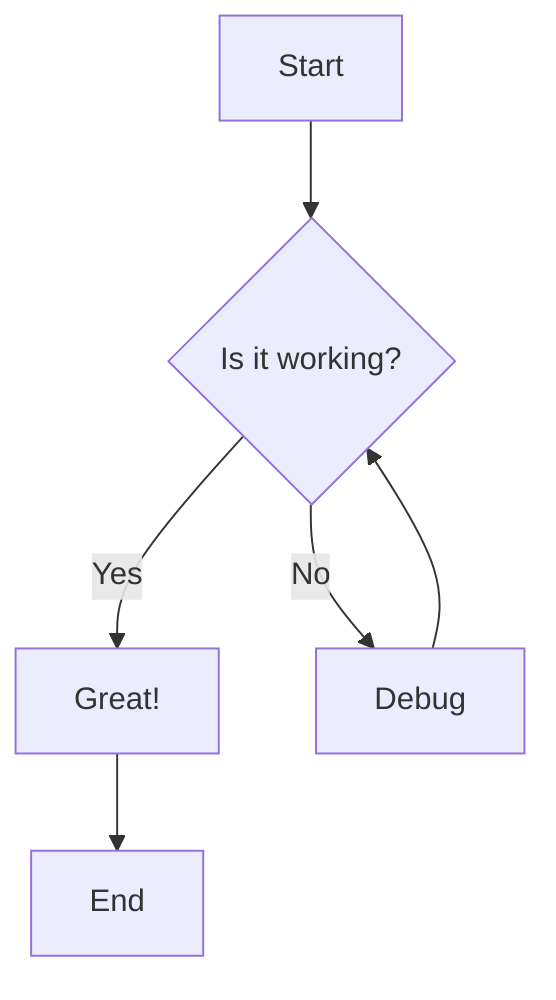
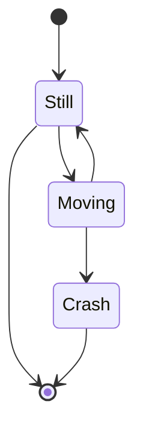
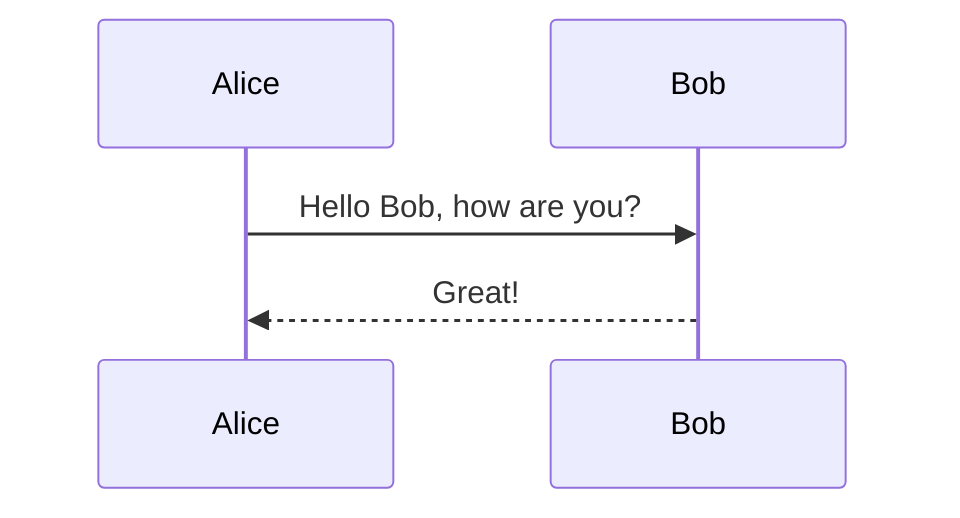

# Mermaid Diagram Test

This is a test guide to verify that mermaid diagrams render correctly in the guide system.

## Simple Flowchart

## State Diagram

## Simple Sequence Diagram

This test should show three different types of mermaid diagrams to verify the implementation is working correctly.
